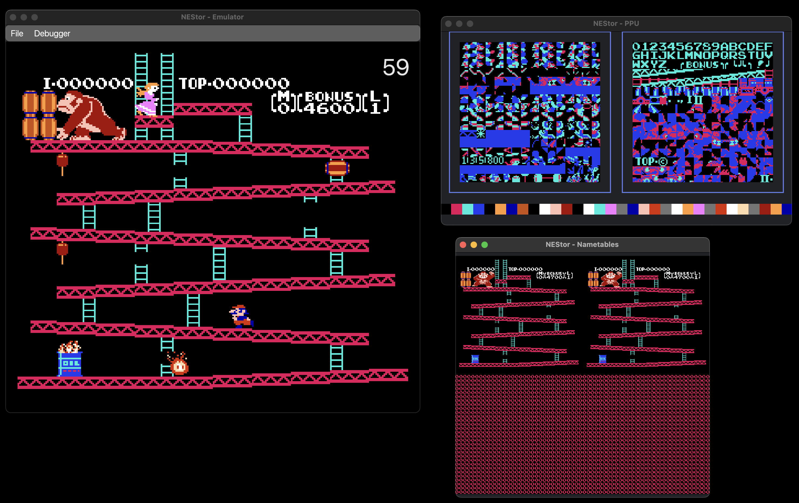

<h1 align="center">
  
   
  <strong>NEStor</strong>
</h1>

NEStor is a NES emulator crafted in Rust for educational purpose. It's not ready for daily gaming sessions yet.

### Screenshots

### Projects

- nestor-browser: Using Yew/Webassembly
- nestor-desktop: Using Iced framework
- nestor-tauri: WIP desktop implementation using Tauri

### TODO

- [x] CPU
    - [x] Official Instructions
    - [x] Unnoficial Instructions
    - [x] Addressing Modes
    - [x] Interrupts
- [ ] ROM
    - [x] Load rom
    - [ ] Mappers
        - [x] NROM
        - [x] CNROM
        - [ ] MMC1
        - [ ] UxROM
        - [ ] MMC3
- [ ] PPU
    - [x] Registers
    - [x] Loopy Registers
    - [x] Rendering
    - [x] Scrolling
    - [x] Sprite priority
    - [x] Sprite 0
    - [ ] Regions
        - [x] NTSC
        - [ ] PAL
- [x] Gamepad
    - [x] 1p
    - [x] 2p
- [ ] APU
- [ ] Save/Load state support
- [ ] Frontends
    - [x] Desktop
        - [ ] Gui
            - [X] Initial Screen
            - [x] Proper menus
            - [ ] Settings
                - [ ] Video config
                - [ ] Gamepad config
        - [ ] Debugger
            - [x] PPU Viewer
            - [x] Nametable Viewer
            - [x] FPS display
            - [ ] Disassembler

    - [ ] Browser (WASM)
        - [ ] Gui
            - [X] Initial Screen
            - [ ] Proper menus
            - [ ] Settings
                - [ ] Video config
                - [ ] Gamepad config
        - [ ] Debugger
            - [x] PPU Viewer
            - [x] Nametable Viewer
            - [x] FPS display
            - [ ] Disassembler
